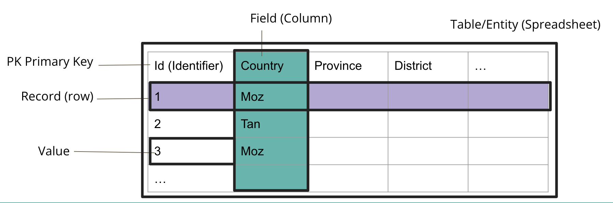

## Motivation
To start let's orient ourselves in our project workflow. Previously we used Excel and OpenRefine to go from messy, human created data to cleaned, computer-readable data.  Now we're going to move to the next piece of the data workflow, using the computer to read in our data, so we can then access it for analysis and visualisation.

## Dataset description
The data we will be using is a subset of data collected from the SAFI (Studying African Farmer-Led Irrigation) project.  This project is looking at farming and irrigation methods. This is survey data relating to households and agriculture in Tanzania and Mozambique. The survey data was collected through interviews conducted between November 2016 and June 2017 using forms downloaded to Android Smartphones.

The survey covered such things as; household features (e.g. construction materials used, number of household members) on farms, agricultural practices (e.g. water usage, crops, plots), assets (e.g. number and types of livestock) and details about the household members.

## What is a relational database?

A relational database is a collection of data items organised as a set of tables. Relationships can be defined between the data in one table and the data in another or many other tables.

The relational database system will provide mechanisms by which you can query the data in the tables, re-assemble the data in various ways without altering the data in the actual tables.

This querying is usually done using SQL (Structured Query Language). SQL allows queries to be constructed from the use of only a few keywords.
Databases are designed to allow efficient querying against very large tables, more than the 1M rows allowed in an Excel spreadsheet.

## What is a table?

As were have noted above, a single table is very much like a spreadsheet. It has rows and it has columns. A row represents a single observation and the columns represents the various variables contained within that observation. 
Often one or more columns in a row will be designated as a 'primary key'. This column or combination of columns can be used to uniquely identify a specific row in the table. 

The columns typically have a name associated with them indicating the variable name. A column always represents the same variable for each row contained in the table. Because of this the data in each column will always be of the same *type*, such as an Integer or Text, of values for all of the rows in the table. Datatypes are discussed in the next section.

## Setup

We use DB Browser for SQLite and the SQL SAFI database/dataset throughout this lesson. See the [setup instructions](https://ywharton.github.io/sql-socialsci/setup.html) on how to download the data, and also how to install the DB Browser for SQLite. 

